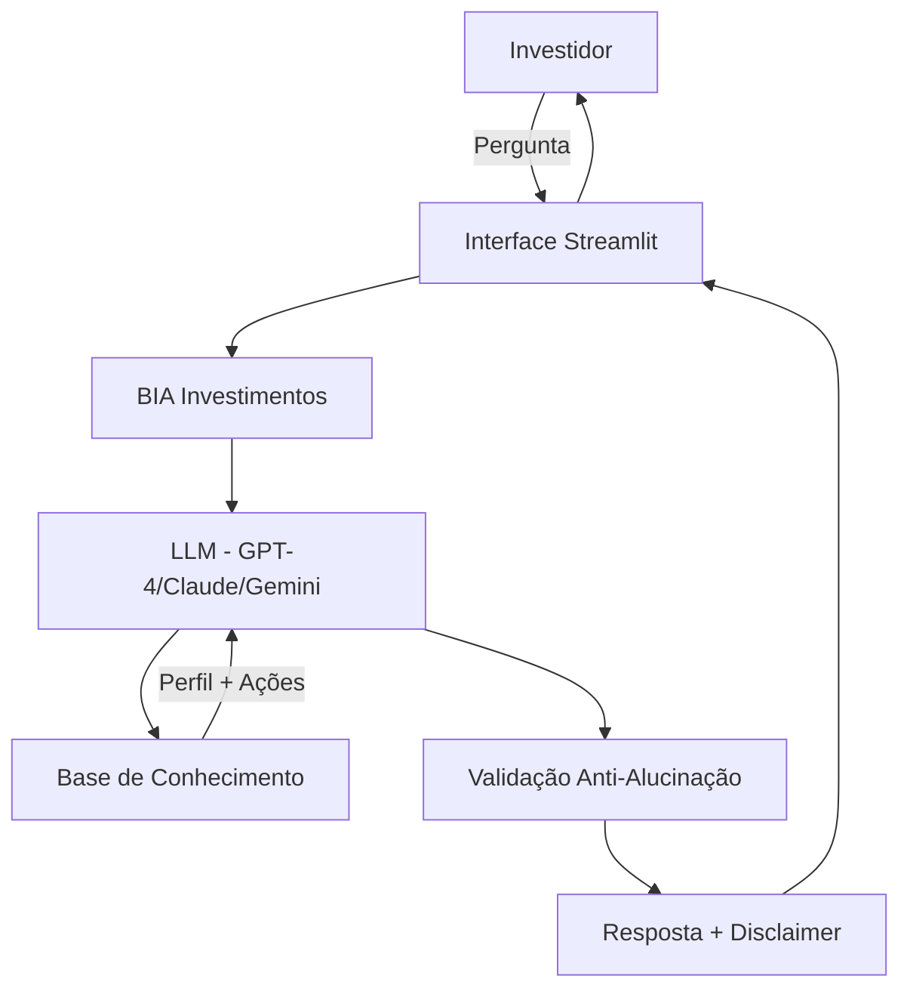

# 📈 BIA Investimentos - Agente Financeiro Inteligente

> Consultora de investimentos em ações da B3 com IA Generativa

## 🎯 Sobre o Projeto

A **BIA Investimentos** (B3 Investments Advisor) é uma agente financeira inteligente que ajuda investidores brasileiros a construir carteiras de ações alinhadas ao seu perfil de risco, utilizando análise fundamentalista e IA Generativa.

> **Inspiração:** Homenagem à BIA do Bradesco, democratizando o acesso a consultoria de investimentos na B3.

### Problema Resolvido

Investidores iniciantes e intermediários enfrentam dificuldades para:
- Entender indicadores fundamentalistas (P/L, ROE, Dividend Yield)
- Selecionar ações compatíveis com seu perfil de risco
- Diversificar carteira entre setores
- Tomar decisões informadas sem assessoria cara

### Solução

Agente conversacional que:
- ✅ Analisa perfil do investidor (conservador, moderado, arrojado)
- ✅ Recomenda ações com base em indicadores fundamentalistas
- ✅ Explica conceitos de forma didática
- ✅ Sugere diversificação por setores
- ✅ **Nunca alucina**: Só recomenda ativos da base de dados
- ✅ **Sempre alerta sobre riscos**: Disclaimers obrigatórios

## 🏗️ Arquitetura



## 📊 Base de Conhecimento

| Arquivo | Conteúdo |
|---------|----------|
| `acoes_b3.json` | 12 ações com indicadores (P/L, ROE, DY, risco) |
| `perfil_investidor.json` | Perfil, objetivos e capital disponível |
| `transacoes.csv` | Histórico financeiro do investidor |
| `historico_atendimento.csv` | Interações anteriores |

**Setores cobertos:** Financeiro, Energia, Mineração, Indústria, Consumo, Varejo, Serviços

## 🚀 Como Usar

### 1. Instalar dependências

```bash
cd src
pip install -r requirements.txt
```

### 2. Configurar LLM (escolha uma)

**OpenAI:**
```bash
cp .env.example .env
# Adicione: OPENAI_API_KEY=sua-chave
```

**Ollama (local, sem API):**
```bash
# Instale: https://ollama.ai/
ollama pull llama2
```

### 3. Rodar aplicação

```bash
streamlit run app.py
```

Acesse: http://localhost:8501

## 💬 Exemplos de Uso

**Pergunta:** "Quero começar a investir em ações. O que você recomenda?"

**Resposta da BIA Investimentos:**
```
Vejo que você tem perfil moderado e R$ 5.000 disponíveis.
Recomendo diversificação entre 3 ações:

1. ITUB4 - Itaú Unibanco (40% - R$ 2.000)
   - Setor: Financeiro | Risco: Baixo
   - P/L: 7.8 | ROE: 18.5% | DY: 5.2%
   - Por quê: Banco sólido, dividendos consistentes

2. PETR4 - Petrobras (35% - R$ 1.750)
   - Setor: Petróleo | Risco: Médio
   - P/L: 4.2 | ROE: 28.5% | DY: 12.8%
   - Por quê: Forte geração de caixa, excelentes dividendos

3. BBAS3 - Banco do Brasil (25% - R$ 1.250)
   - Setor: Financeiro | Risco: Baixo
   - P/L: 5.2 | ROE: 16.8% | DY: 8.5%
   - Por quê: Diversificação no setor financeiro

⚠️ Importante: Investimentos em ações envolvem riscos.
Rentabilidade passada não garante resultados futuros.
```

## 🛡️ Segurança e Anti-Alucinação

### Estratégias Implementadas

1. **Restrição de dados**: Só recomenda ações da base fornecida
2. **Validação de perfil**: Verifica compatibilidade risco x perfil
3. **Disclaimers obrigatórios**: Sempre alerta sobre riscos
4. **Admissão de limitações**: Quando não sabe, diz claramente
5. **Sem garantias**: Nunca promete rentabilidade

### Limitações Declaradas

O agente **NÃO**:
- ❌ Fornece cotações em tempo real
- ❌ Executa ordens de compra/venda
- ❌ Garante rentabilidade futura
- ❌ Substitui assessoria certificada
- ❌ Recomenda day trade
- ❌ Analisa criptomoedas

## 📁 Estrutura do Projeto

```
dio-lab-bia-do-futuro/
├── data/                    # Base de conhecimento
│   ├── acoes_b3.json       # Ações da B3 com indicadores
│   ├── perfil_investidor.json
│   ├── transacoes.csv
│   └── historico_atendimento.csv
│
├── docs/                    # Documentação completa
│   ├── 01-documentacao-agente.md
│   ├── 02-base-conhecimento.md
│   ├── 03-prompts.md
│   ├── 04-metricas.md
│   └── 05-pitch.md
│
├── src/                     # Código da aplicação
│   ├── app.py              # Interface Streamlit
│   ├── agente.py           # Lógica do agente
│   ├── requirements.txt
│   └── .env.example
│
└── assets/                  # Recursos visuais
```

## 🎓 Tecnologias

- **Interface**: Streamlit
- **LLMs**: OpenAI GPT-4, Anthropic Claude, Google Gemini, Ollama
- **Dados**: JSON, CSV, Pandas
- **Linguagem**: Python 3.8+

## 📈 Métricas de Qualidade

| Métrica | Resultado |
|---------|-----------|
| Assertividade | ✅ Recomendações alinhadas ao perfil |
| Segurança | ✅ Sem alucinações, disclaimers presentes |
| Coerência | ✅ Diversificação adequada por setor |
| Didática | ✅ Explicações claras de indicadores |

## 🎬 Pitch (3 minutos)

**Problema:** Investidores iniciantes não sabem como começar na bolsa

**Solução:** BIA Investimentos - consultora inteligente que educa e recomenda

**Diferencial:** 
- Educativo (não apenas reativo)
- Seguro (anti-alucinação)
- Personalizado (perfil + objetivos)

**Impacto:** Democratiza acesso a consultoria de investimentos

## 🔮 Próximos Passos

- [ ] Integrar cotações em tempo real (Alpha Vantage API)
- [ ] Adicionar análise de correlação entre ativos
- [ ] Expandir para FIIs e Renda Fixa
- [ ] Criar simulador de rentabilidade histórica

## 📄 Licença

Projeto educacional - DIO (Digital Innovation One)

## 👤 Autor

Desenvolvido como parte do desafio "Agente Financeiro Inteligente com IA Generativa" por Ramon Azevedo.

---

⚠️ **Aviso Legal:** Este é um protótipo educacional. Não constitui recomendação de investimento. Consulte sempre um assessor financeiro certificado antes de investir.
